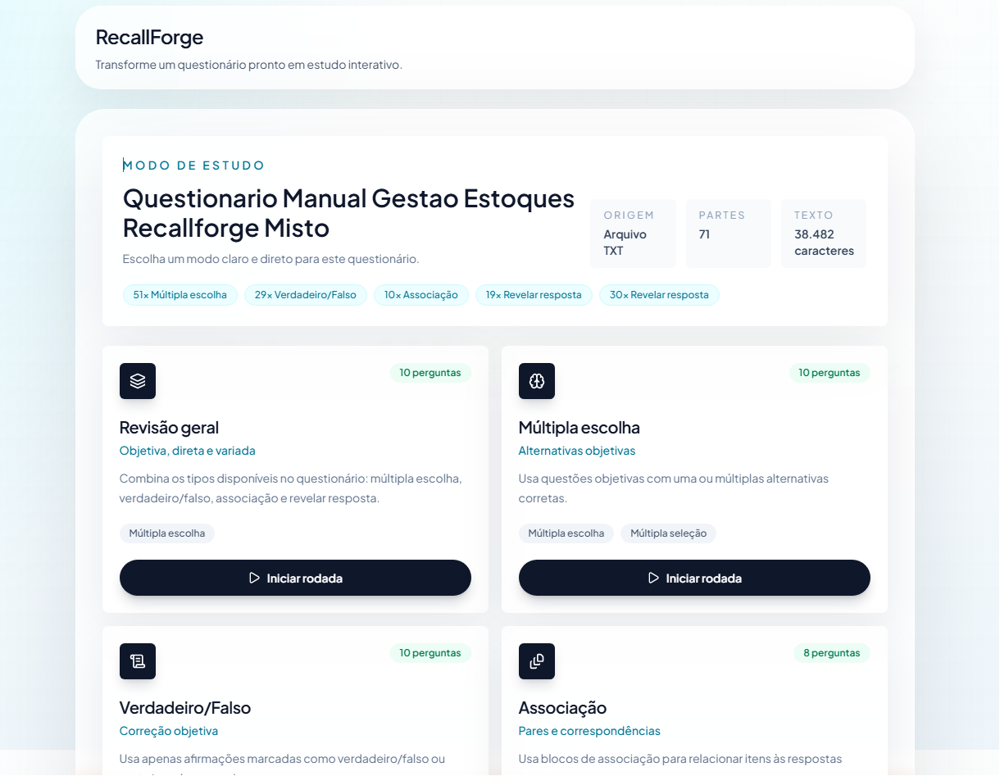

# RecallForge

> Transforme materiais de estudo em questionários interativos, revisáveis e prontos para praticar.

O **RecallForge** é uma aplicação web criada para converter conteúdos estruturados em experiências de estudo mais objetivas. A plataforma recebe arquivos ou textos, identifica perguntas e respostas, permite revisar o conteúdo importado e gera diferentes modos de prática.

O projeto foi pensado para reduzir o trabalho manual de montar questionários, preservando o controle do usuário sobre o material final.

<p align="center">
  
</p>


---

## Visão geral

Com o RecallForge, o usuário pode:

- importar materiais em formatos como `.txt`, `.pdf` e `.docx`;
- colar conteúdo diretamente na aplicação;
- revisar perguntas antes de adicioná-las ao material;
- praticar o mesmo conteúdo em diferentes modos;
- utilizar questionários com múltipla escolha, verdadeiro ou falso, associação e flashcards;
- manter o conteúdo organizado em uma interface simples e responsiva.

---

## Principais recursos

### Importação de materiais

Formatos suportados:

- TXT
- PDF
- DOCX
- Texto colado

### Revisão antes da importação

Antes de adicionar as questões ao material, o usuário pode conferir o conteúdo reconhecido, corrigir inconsistências e aprovar apenas o que deseja utilizar.

### Modos de estudo

O mesmo material pode ser praticado em diferentes formatos:

- **Múltipla escolha**
- **Verdadeiro ou falso**
- **Associação**
- **Flashcards**

### Questionários estruturados

O RecallForge reconhece blocos de conteúdo identificados por tipo.

Exemplo:

```txt
[MULTIPLA ESCOLHA]
P: Qual é a capital do Brasil?
A) Rio de Janeiro
B) Brasília
C) São Paulo
D) Salvador
Gabarito: B

[VERDADEIRO OU FALSO]
Afirmação: Brasília é a capital do Brasil.
Gabarito: Verdadeiro

[ASSOCIACAO]
Instrução: Associe cada país à sua capital.
1. Brasil => Brasília
2. Argentina => Buenos Aires
3. Chile => Santiago

[FLASHCARD]
Frente: Qual é a capital do Brasil?
Verso: Brasília
```

---

## Fluxo de uso

1. O usuário envia um arquivo ou cola um texto.
2. O sistema processa o conteúdo.
3. As questões encontradas são apresentadas para revisão.
4. O usuário aprova ou corrige o material.
5. O questionário é salvo.
6. O conteúdo pode ser praticado em diferentes modos de estudo.

---

## Tecnologias

### Front-end

- Next.js
- React
- TypeScript
- Tailwind CSS

### Dados e persistência

- Prisma ORM
- PostgreSQL

### Deploy

- Netlify

---

## Estrutura do projeto

```text
.
├── app/
│   ├── api/
│   ├── materials/
│   ├── quiz/
│   └── page.tsx
├── components/
├── lib/
├── prisma/
├── public/
├── styles/
├── types/
├── package.json
└── README.md
```

---

## Roadmap

- aprimorar o reconhecimento de questionários extensos;
- aumentar a cobertura de diferentes padrões de formatação;
- melhorar a detecção de blocos de associação;
- ampliar as ferramentas de revisão;
- adicionar filtros e organização por matéria;
- permitir exportação de questionários;
- melhorar relatórios de progresso;
- ampliar a suíte de testes;
- aperfeiçoar acessibilidade e experiência mobile.

---

## Contribuição

Contribuições são bem-vindas.

1. Faça um fork do projeto.
2. Crie uma branch para sua alteração.

```bash
git checkout -b feature/minha-melhoria
```

3. Faça o commit.

```bash
git commit -m "feat: adiciona nova funcionalidade"
```

4. Envie a branch.

```bash
git push origin feature/minha-melhoria
```

5. Abra um Pull Request.

---

## Boas práticas

- mantenha o código tipado;
- preserve os padrões existentes;
- evite alterações estruturais desnecessárias;
- adicione testes quando aplicável;
- descreva claramente o problema resolvido;
- mantenha a interface responsiva;
- não introduza dependências sem necessidade real.

---

## Status

O RecallForge está em desenvolvimento ativo.

A aplicação já possui fluxo funcional de importação, revisão e geração de questionários, enquanto continua evoluindo para reconhecer materiais cada vez mais variados com maior precisão.

---

## Autor

Desenvolvido por **Patrick Otero**.

---

<p align="center">
  <strong>RecallForge</strong><br>
  Estude melhor. Revise com mais eficiência.
</p>
